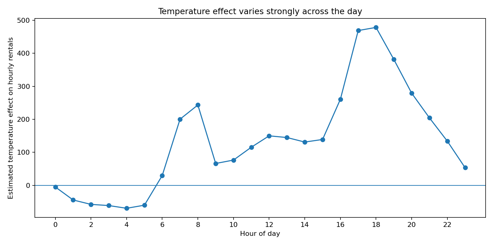
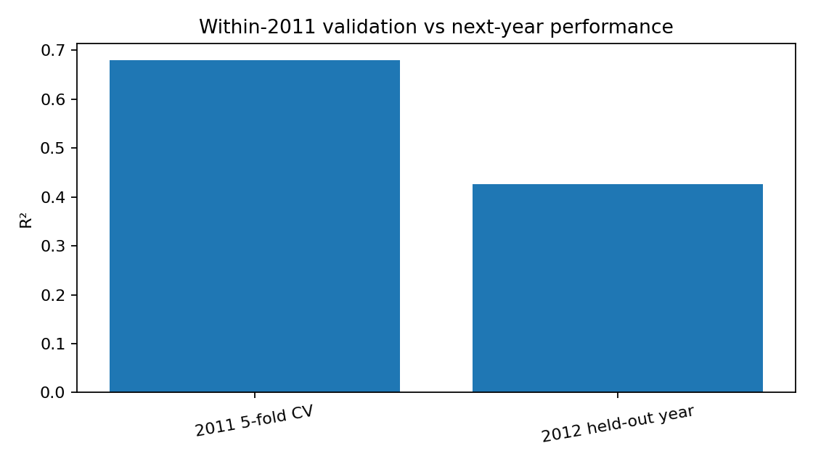
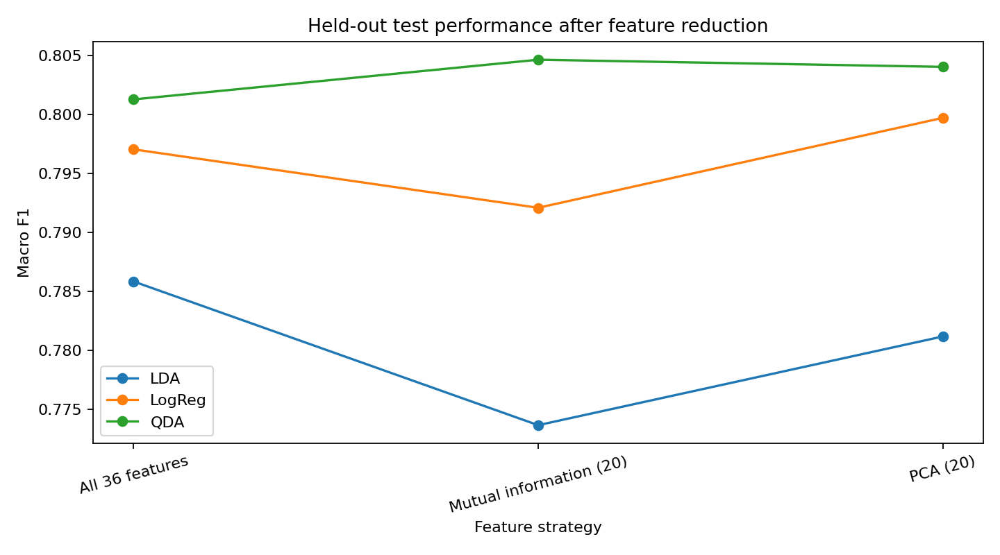
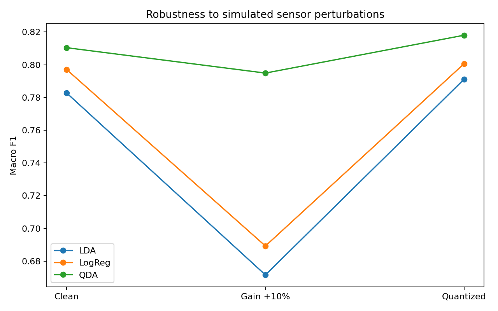

# Applied Machine Learning Analysis

A cleaned and extended version of a university machine-learning laboratory project, prepared as a portfolio repository. It combines **regression / interaction analysis on bike-sharing demand** with **multiclass classification on Landsat satellite data**.

The original laboratory work was reworked for GitHub with an emphasis on reproducibility and evaluation quality: fixed random seeds, held-out testing, train-only preprocessing and feature selection, corrected temporal validation, and clearer project structure.

## What this project demonstrates

- Python data analysis with pandas / NumPy
- Regression with interactions and regularization
- Temporal validation and distribution-shift diagnostics
- Logistic Regression, LDA and QDA
- ROC/AUC and probability-threshold analysis
- Feature selection and PCA
- Learning-curve / small-sample analysis
- Robustness testing under simulated sensor perturbations
- Reproducible scikit-learn pipelines

## Key findings

### Bike-sharing regression

- The estimated temperature effect is strongly hour-dependent and peaks around the evening commute (around 17:00–18:00 in the fitted interaction model).
- Wind speed has a more negative standardized association with **casual** demand than with **registered** demand (`-0.042` vs `-0.011` in comparable log-target models).
- After correcting the weekend definition and fitting all standardized weather interactions jointly, **humidity** has the largest absolute weekend interaction (`-0.158`), followed by temperature (`+0.138`) and wind speed (`-0.075`).
- Five-fold validation within 2011 gives `R² ≈ 0.680` and RMSE ≈ `75.6`, while the same pipeline fitted on all 2011 data reaches only `R² ≈ 0.427` with RMSE ≈ `158.1` on the held-out 2012 year. This is evidence consistent with temporal shift, not proof of a specific causal drift mechanism.
- The 2012 held-out `casual / total` share model reaches `R² ≈ 0.437` and RMSE ≈ `0.095`.





### Satellite classification

- Strong correlations appear across the 36 spectral features, motivating explicit checks of LDA/QDA assumptions.
- For class 1 vs class 7, logistic regression reaches **ROC AUC = 1.000** on the official test split.
- Feature reduction does not consistently improve performance: QDA obtains about `0.853` accuracy with all features and `0.854` after PCA to 20 components; linear models change only slightly.
- Quadratic logistic regression reaches about **0.888 accuracy / 0.872 macro-F1**, compared with QDA at roughly **0.853 accuracy / 0.801 macro-F1** under the same official train/test split.
- Under a simulated +10% gain shift, QDA degrades less than Logistic Regression and LDA in this experiment.





## Repository structure

```text
applied-machine-learning-analysis/
├── README.md
├── requirements.txt
├── .gitignore
├── data/
│   ├── README.md
│   ├── hour.csv
│   ├── satellite_train.csv
│   └── satellite_test.csv
├── figures/
│   └── generated plots used in this README
└── notebooks/
    ├── 01_bike_rental_regression.ipynb
    └── 02_satellite_classification.ipynb
```

## How to run

```bash
python -m venv .venv

# macOS / Linux
source .venv/bin/activate

# Windows PowerShell
# .venv\Scripts\Activate.ps1

pip install -r requirements.txt
jupyter lab
```

Open the notebooks from the `notebooks/` folder and run them from top to bottom. They automatically locate the repository's `data/` directory whether Jupyter is launched from the repository root or the notebooks folder.

## Methodology improvements made for the portfolio version

The original assignment contained several analysis choices that were acceptable for exploration but weaker for a public portfolio. This version changes them deliberately:

1. **Feature-selection evaluation uses the official test set.** The original notebook evaluated feature-reduction strategies on the same data used for fitting.
2. **Concept-drift analysis compares within-2011 validation with next-year performance.** It no longer compares training scores from independently fitted 2011 and 2012 models.
3. **The casual-share task fits its own model.** It no longer reuses coefficients from a previous weekend-demand regression.
4. **Weekend status is derived from the actual date.** This avoids relying on an assumed integer encoding of `weekday`.
5. **Probability thresholds are tuned on validation data, not the test set.**
6. **Randomized experiments use fixed seeds and stratification where appropriate.**

## Datasets

Both datasets are from the **UCI Machine Learning Repository** and are distributed under **CC BY 4.0**. Full attribution and DOI information is available in [`data/README.md`](data/README.md).

- Bike Sharing — Hadi Fanaee-T (2013), DOI `10.24432/C5W894`
- Statlog (Landsat Satellite) — Ashwin Srinivasan (1993), DOI `10.24432/C55887`

## Notes

This is an academic portfolio project. Results are intended to demonstrate modelling and evaluation skills; predictive associations should not be interpreted as causal effects.
